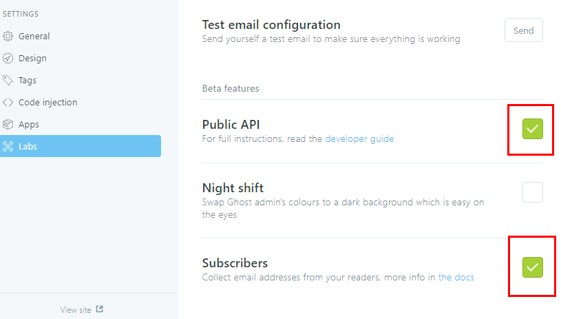
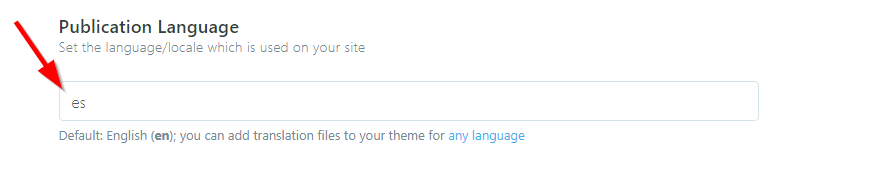
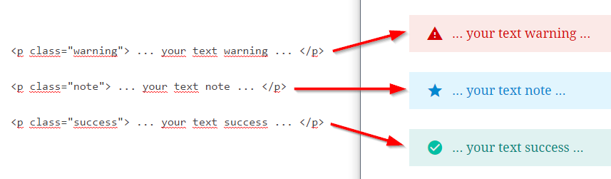
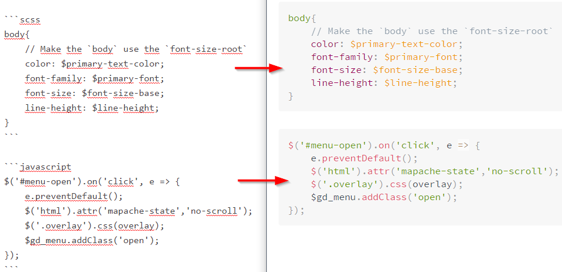

# FirePress_simply

## Touch it: Live demo

[](https://github.com/TryGhost/Ghost)

- [See this theme](#) on your own device.
- Even better! [Login into Ghost Admin Panel](#) and see how this theme looks with your own content. 

*(The website is in the pipeline but it’s not public at the moment.)*

**Screenshots** can be found [here](#).


## Why fork this Ghost Theme ?

**Enhancements** — This theme is an enhanced version of the Ghost Theme **simply**. If you don’t know [Ghost](https://ghost.org/) it’s great tools to publish your website and your blog. These are the essential enhancements I can’t live without:

- **Icons** (Font Awesome 5)

**Drop-in replacement** — No special tweaks to do. It will work out of the box.

**Code Injection** — Take a look those snippets in this [Git repo](https://github.com/firepress-org/Code-Injection-Ghost). It’s an easy way to customize your theme.

**Curated** — This theme is one the few themes that pass our big test. See the curated collection [in this Git repo](https://github.com/firepress-org/Ghost-Theme-Curated-Collection/tree/master/01_go).

**Compatibility** — This theme will work on [Ghost](https://ghost.org/) >= **1.0**.

I didn’t include those elements in this theme as I saw many styling conflicts:

- **Buttons** (unicorn UI)
- **Code Syntax** (highlight.js) 
- **Grid** (great to make pricing table)

### Ghost Settings

> Enable all checkboxes on the labs page in your Ghost admin panel.



### Social Links

Add the Social Links only for the services you want to appear in the header section of your website. Pay attention as enabling too many services will cause menu problems.

### YouTube Subscribe Button

This section enables the YouTube Post format. Add the Channel Name and Channel ID which can be found here [YouTube Advanced Settings](https://www.youtube.com/account_advanced)

— Copy the below script to `Settings -> Code Injection  -> Blog Footer section`

```html
<script>
/*====================================================
  THEME SETTINGS & GLOBAL VARIABLES
====================================================*/

/* 01. Social Media Follow*/
var followSocialMedia = {
  'google': 'https://...',
  'youtube': 'https://...',
  'instagram': 'https://...',
  'snapchat': 'https://...',
  'dribbble': 'https://...',
  'github': 'https://...',
  'linkedin':'https://...',
  'spotify':'https://...',
  'codepen':'https://...',
  'behance':'https://...',
  'flickr':'https://...',
  'pinterest':'https://...',
  'telegram':'https://...',
  'feed':'https://...',
};

/* 0.2  Video Post Format Subscribe */
var youtubeChannelName = 'YOUR_CHANNEL_NAME';
var youtubeChannelID = 'YOUR_CHANNEL_ID';

/* 03. Disqus Comment Settings */
var disqusShortName = 'YOUR_DISQUS_SHORTCUT_HERE';

/* 04. Newsletter (optional) */
var newsletterTitle = 'YOUR_TITLE';
var newsletterDescription = 'YOUR_DESCRIPTION';

/* 05. instgram */
var instagramToken = 'Token_app_instagram';
var instagramUserId = 'User_ID';
var instagramUserName = 'User_Name';
</script>

<!-- Disqus Comments Count-->
<script id="dsq-count-scr" src="//YOUR_DISQUS_SHORTCUT_HERE.disqus.com/count.js" async></script>
```

### Facebook Comments

To use facebook comments, skip the configuration Disqus.

This enables comments and comment counter

— Add the code `Settings -> Code Injection -> Blog Footer`

```html
  <div id="fb-root"></div>
  <script>(function(d, s, id) {
    $('.simply-facebook, #post-comments').removeClass('u-hide');
    var js, fjs = d.getElementsByTagName(s)[0];
    if (d.getElementById(id)) return;
    js = d.createElement(s); js.id = id;
    js.async=true;
    js.src = "//connect.facebook.net/en_US/sdk.js#xfbml=1&version=v2.8";
    fjs.parentNode.insertBefore(js, fjs);
  }(document, 'script', 'facebook-jssdk'));</script>
```

## Publication Language



Mapache supports English and Spanish languages.
if you want to have in another language you just have to copy `locales>en.json` and rename the file then translate to your favorite language:

Just enter the [language/locale tag](https://www.w3schools.com/tags/ref_language_codes.asp) of the files to use (e.g.: `fr.json` for French, `zh.json` for Chinese, `ja.json` for Japanese)

## Add additional content to the sidebar

Add you own custom content into the side bar by editing the `./partials/sidebar.hbs` file.

```html
<div class="sidebar-items u-marginBottom30">
    <h3 class="sidebar-title u-fontSizeBase u-textColorDarker">.. your title ..</h3>
    <p class="u-textColorDarker u-fontSize15 u-marginBottom10">.. your description or content ..</p>
</div>
```

## Warning - Note - Success

Add some more styling options to your articles text with these three styles.



### PrismJS code syntax

Make your code stand out with the PrismJS code highlighter.
PrismJS allows you to select which languge you embeded and performs code highlighting according to the language. Neat!

Take a look at the [Prismjs Supported Language List](http://prismjs.com/#languages-list)



## Template for (Video - Image - Audio)

**Image** — The Featured image will become large in size.

**Not Image** — The featured image will not be displayed in the article (Post).

**Video** — The first video in the article will be large in size. Supports formats

- vimeo
- Dailymotion
- Youtube
- Vid
- kickstarter

**Audio** — The first Audio in the article will be large in size. Supports formats

- Soundcloud
- Mixcloud
- Spotify

### Change Theme Style

To make your changes with your favorite colors you just have to add the following code and replace with your colors
[Themes](THEMES.md).

## About simply 

Hello, I created this theme for Ghost with inspiration from [Medium](https://medium.com/).
It is available for free so you can use on your site. It is strictly forbidden to use it for commercial use. If you have any suggestions to improve the theme,  you can send me a tweet [@GodoFredoNinja](https://goo.gl/y3aivK).

### ❤ Please, help me with a small donation on [Paypal](https://bit.ly/PayPal-GodoFredoNinja). It'll help motivate me to update the theme with many improvements

[](https://bit.ly/PayPal-GodoFredoNinja)


## Featured

- Support for different [languages](http://themes.ghost.org/docs/i18n#section-how-to-add-any-language) (en - es)
- Responsive layout
- Blog navigation
- Page 404 (Multiple faces emoticons)
- Page subscribe
- Pagination Infinite Scroll
- Instagram Feed in footer of Post
- [AMP](https://github.com/godofredoninja/Hodor-AMP-Template-for-Ghost) Template (Accelerated Mobile Pages)
- Cover images for blog, tag and author
- links to followers in social media
- Related Articles (6 articles)
- Template Video Post Format
- Template Image post Format
- Template Audio post Format
- Template not Image Featured in Post
- YouTube Subscribe Button in video post Format
- 5 articles latest posts in the (Author - Tag) section sidebar
- Tags Cloud in page of Author and Tag
- Previous and next button in the Post
- Support for comments (Facebook or Disqus)
- Support for counter comments (Facebook or Disqus)
- Buttons to share the article (Facebook - Twitter - Reddit - Linkedin - Pinterest - Whatsapp)
- Counter shared articles on Facebook
- Sticky content in the sidebar
- YouTube, Vimeo, kickstarter, Facebook, dailymotion => Responsive
- Lazy image loading for better performance only in backgrounds
- Code syntax [Prismjs](http://prismjs.com/index.html#languages-list) Supported all syntax.


## Contributing

Thanks to the power of communities, this is where `1 + 1 = 3`.

1. Fork it
2. Create your feature branch: `git checkout -b my-new-feature`
3. Commit your changes: `git commit -am 'Add some feature'`
4. Push to the branch: `git push origin my-new-feature`
5. Submit a pull request


## Copyright & License

Copyright (c) 2017 GodoFredoNinja - Released under the [CC BY-NC 4.0](LICENSE).


## Sources

- This Git repo is available [here](https://github.com/firepress-org/FirePress_simply).
- This project was forked from this [Git repo](https://github.com/godofredoninja/simply).


## Author

In the git world most people refer themselves as maintainers but I hate this expression. It feels heavy. I much prefer author.

Shared by [Pascal Andy](https://pascalandy.com/blog/now/). Find me on [Twitter](https://twitter.com/askpascalandy).


